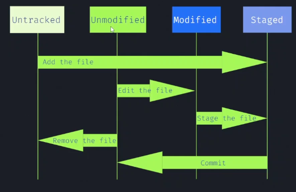

# O que é Git?
## Versionamento
- Registro de mudanças em arquivos, que possibilita recuperação ou acesso a versões anteriores;
- Desenvolvimento de código em colaboração com outros integrantes. 

Git é um sistema de versionamento de código, que guarda os registros de versão como snapshots (fotos) do estado do projeto, além da referência/caminho para essa foto.

A maioria das operações feitas pelo Git são locais e por isso boa parte das operações são praticamente instantâneas devido à facilidade de acessar arquivos em seu próprio computador.

# Repositórios do Git
git init

git clone

# Gravando mudanças no repositório
 
Unmodified: Esse arquivo já está mapeado, já passou por um processo de Staged, além de ter dado commit em cima desse arquivo. Um arquivo salvo no formato em que está.
Modified: Arquivo modificados e que podem querer ser passado para o próximo commit.
git status - Mostra qual a branch estamos.
Staged: área preparatória para o commit.
 
```git add```

# Git diff e Commit
git diff: Mostra exatamente as linhas que foram modificadas.

```git diff  --staged```

Mostra a diferença entre os arquivos que estavam modifed e staged, pois se for só o comando "gif diff" ele não mostrará nada

*depois do git add*

```git commit -m "comentário"```

# Git log e Restore
git log: Traz o históricos dos últimos commits feitos, mostra a branch, o autor do commit, mostra a mensagem


git restore: Retorna arquivos modificados

```git restore --staged .\nome do arquivo```
Identifica onde o comando restore será utilizado, no exemplo feito, o arquivo voltará da area de staged para change novamente.
