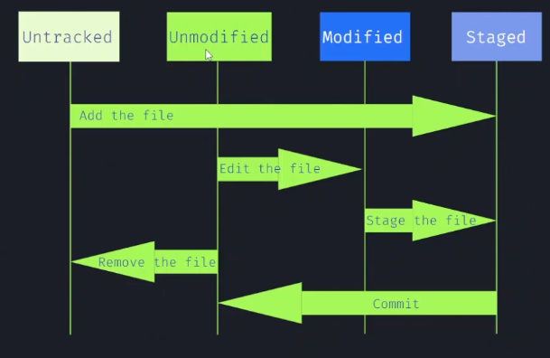
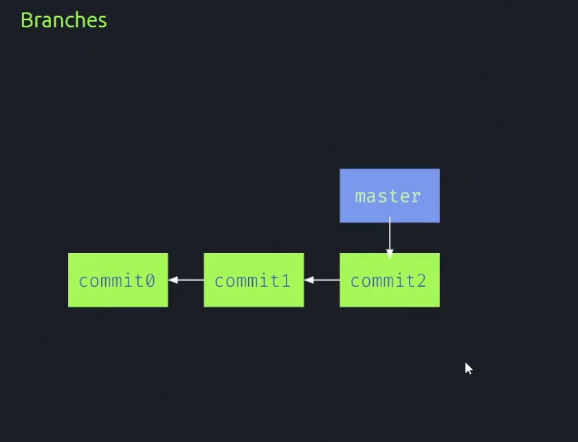

# O que é Git?

## Versionamento

- Registro de mudanças em arquivos, que possibilita recuperação ou acesso a versões anteriores;
- Desenvolvimento de código em colaboração com outros integrantes.

Git é um sistema de versionamento de código, que guarda os registros de versão como snapshots (fotos) do estado do projeto, além da referência/caminho para essa foto.

A maioria das operações feitas pelo Git são locais e por isso boa parte das operações são praticamente instantâneas devido à facilidade de acessar arquivos em seu próprio computador.

# Repositórios do Git

git init

git clone

# Gravando mudanças no repositório

Unmodified: Esse arquivo já está mapeado, já passou por um processo de Staged, além de ter dado commit em cima desse arquivo. Um arquivo salvo no formato em que está.
Modified: Arquivo modificados e que podem querer ser passado para o próximo commit.
git status - Mostra qual a branch estamos.
Staged: área preparatória para o commit.

`git add`

# Git diff e Commit

git diff: Mostra exatamente as linhas que foram modificadas.

`git diff  --staged`

Mostra a diferença entre os arquivos que estavam modifed e staged, pois se for só o comando "gif diff" ele não mostrará nada

_depois do git add_

`git commit -m "comentário"`

# Git log e Restore

git log: Traz o históricos dos últimos commits feitos, mostra a branch, o autor do commit, mostra a mensagem

git restore: Retorna arquivos modificados

`git restore --staged .\nome do arquivo`
Identifica onde o comando restore será utilizado, no exemplo feito, o arquivo voltará da area de staged para change novamente.

# Git Branch

# Merging branches

`git marge nome da branch q quero juntar`

### Anotações

git push github main

git remote

git push "remote" "branch"
